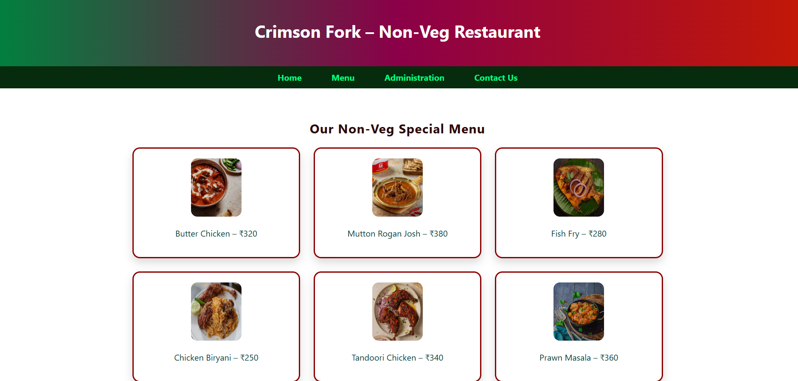
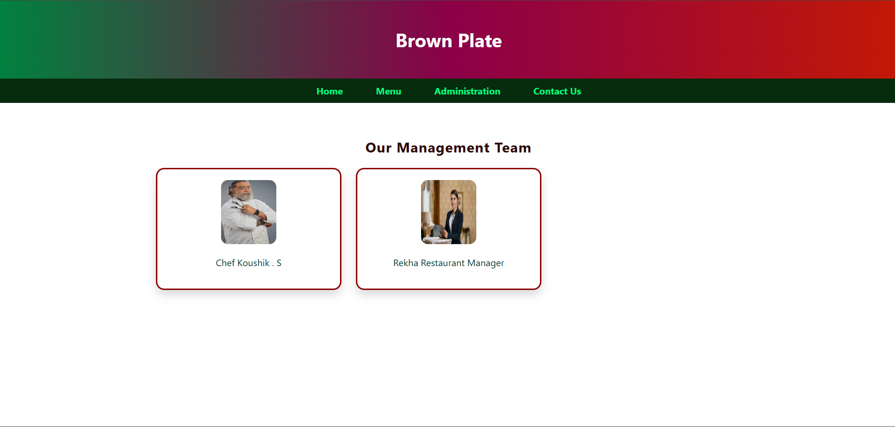

# Ex.07 Restaurant Website
## Date:19.12.2025
## Ref no:25003349

## AIM:
To develop a static Restaurant website to display the food items and services provided by them.

## DESIGN STEPS:

### Step 1:
Requirement collection.

### Step 2:
Creating the layout using HTML and CSS.

### Step 3:
Updating the sample content.

### Step 4:
Choose the appropriate style and color scheme.

### Step 5:
Validate the layout in various browsers.

### Step 6:
Validate the HTML code.

### Step 7:
Publish the website in the given URL.

## PROGRAM:
~~~
admin.py

<!DOCTYPE html>
<html>
<head>
    <title>Brown Plate - Administration</title>
    <link rel="stylesheet" href="index.css">
</head>
<body>

<header>
    <h1>Brown Plate</h1>
</header>

<nav>
    <a href="home.html">Home</a>
    <a href="menu.html">Menu</a>
    <a href="admin.html">Administration</a>
    <a href="contact.html">Contact Us</a>
</nav>

<section>
    <h2>Our Management Team</h2>

    

        

Chef Koushik . S

        

Rekha Restaurant Manager

    

</section>

</body>
</html>

home.html

<!DOCTYPE html>
<html>
<head>
    <title>Brown Plate</title>
    <link rel="stylesheet" href="index.css">
</head>
<body>

<header>
    <h1>Brown Plate – Non-Veg Restaurant</h1>
</header>

<nav>
    <a href="home.html">Home</a>
    <a href="menu.html">Menu</a>
    <a href="admin.html">Administration</a>
    <a href="contact.html">Contact Us</a>
</nav>

<section>
    
    <h2>Welcome to Brown Plate</h2>
    
Bold flavors, premium non-veg dishes, and a royal dining experience.

</section>

</body>
</html

contact.html

<!DOCTYPE html>
<html>
<head>
    <meta charset="UTF-8">
    <title>Brown Plate - Contact Us</title>
    <link rel="stylesheet" href="index.css">
</head>
<body>

<header>
    <h1>Brown Plate – Non-Veg Restaurant</h1>
</header>

<nav>
    <a href="home.html">Home</a>
    <a href="menu.html">Menu</a>
    <a href="admin.html">Administration</a>
    <a href="contact.html">Contact Us</a>
</nav>

<section>
    

        <h2>Contact Us</h2>
        
<b>Address:</b>16, Kevin street, Food Plaza, chennai 

        
<b>Phone:</b> +91 8015920331

        
<b>Email:</b> support@BrownPlate.com

        
<b>Timing:</b> 10:00 AM – 12:00 PM

    

</section>

</body>
</html>

menu.html

<!DOCTYPE html>
<html>
<head>
    <meta charset="UTF-8">
    <title>Crimson Fork - Menu</title>
    <link rel="stylesheet" href="index.css">
</head>
<body>

<header>
    <h1>Crimson Fork – Non-Veg Restaurant</h1>
</header>

<nav>
    <a href="home.html">Home</a>
    <a href="menu.html">Menu</a>
    <a href="admin.html">Administration</a>
    <a href="contact.html">Contact Us</a>
</nav>

<section>
    <h2>Our Non-Veg Special Menu</h2>

    

        

Butter Chicken – ₹320

        

Mutton Rogan Josh – ₹380

        

Fish Fry – ₹280

        

Chicken Biryani – ₹250

        

Tandoori Chicken – ₹340

        

Prawn Masala – ₹360

    

</section>

</body>
</html>

index.css

body {
    font-family: 'Segoe UI', sans-serif;
    margin: 0;

    /* Background image */
    background-image: url("bground.png"); /* put your image name here */
    background-size: cover;        /* makes image cover full screen */
    background-position: center;   /* centers the image */
    background-repeat: no-repeat;  /* prevents repeating */
    background-attachment: fixed;  /* nice scrolling effect */

    color: #0a3b37;
}

/* Header */
header {
    background: linear-gradient(90deg, #00813e, #8b0048, #c21807);
    color: white;
    padding: 24px;
    text-align: center;
}

/* Navigation */
nav {
    background-color: #062b0d;
    text-align: center;
}

nav a {
    color: #00ff80;
    text-decoration: none;
    margin: 0 16px;
    padding: 10px;
    display: inline-block;
    font-weight: bold;
}

nav a:hover {
    background-color: #ffd700;
    color: #2b0606;
    border-radius: 6px;
}

/* Section */
section {
    padding: 40px;
    text-align: center;
}

/* Banner */
.banner {
    width: 80%;
    max-width: 420px;
    border-radius: 12px;
}

/* Headings */
h2 {
    color: #2b0606;
    letter-spacing: 1px;
}

/* Grid */
.menu-grid, .team-grid {
    display: grid;
    grid-template-columns: repeat(3, 1fr);
    gap: 25px;
    max-width: 1000px;
    margin: auto;
}

/* Cards */
.card {
    background-color: #fff;
    padding: 18px;
    border-radius: 14px;
    box-shadow: 0 8px 16px rgba(0,0,0,0.15);
    border: 3px solid #8b0000;
}

.card img {
    width: 95px;
    height: 110px;
    border-radius: 12px;
}

/* Contact */
.contact-container {
    background-color: #fff;
    padding: 25px;
    border-radius: 14px;
    max-width: 750px;
    margin: auto;
    box-shadow: 0 6px 15px rgba(0,0,0,0.15);
}

~~~

## OUTPUT:
.png>)

## RESULT:
The program for designing software company website using HTML and CSS is completed successfully.
